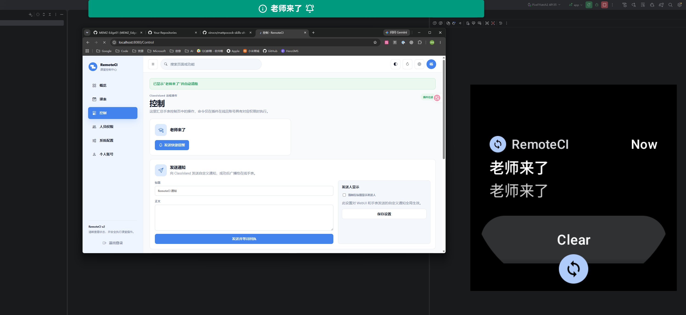
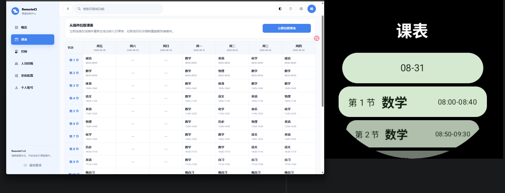
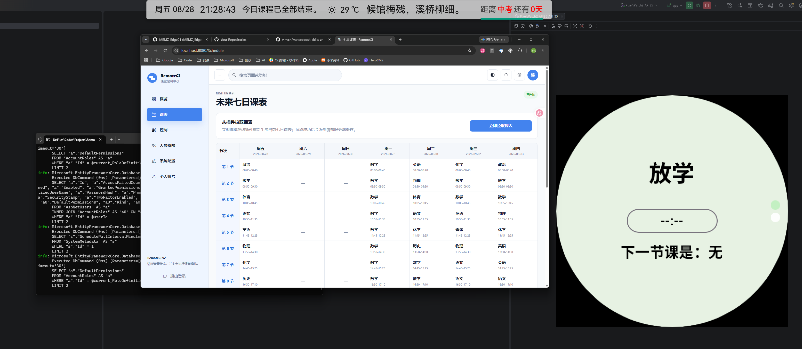

# RemoteCI

[](https://github.com/MEMZ-Edge01/RemoteCI/actions/workflows/ci.yml)
[](https://github.com/MEMZ-Edge01/RemoteCI/releases)
[](LICENSE)

> 把 ClassIsland 的课表、通知和受控操作，安全地延伸到 Web 与 Wear OS。

RemoteCI 是面向 ClassIsland 2.x 的跨设备联动系统，由 ClassIsland 插件、ASP.NET Core 服务端、WebUI 和 Wear OS 应用组成。它让用户可以在浏览器或手表上查看当前课程与未来七日课表、接收课堂事件，并在权限允许时执行通知、换课和扩展操作。

当前稳定软件版本为 `3.2.1.0`，通信协议为 V3。稳定版使用 ClassIsland 要求的四段纯数字版本；保留的 Beta 使用 `v3.x.x-beta.y`，仅用于测试且不会进入插件市场。

## ✨ 主要能力

- **课程状态同步**：插件按秒推送当前课程状态，并独立同步未来七日课表。
- **Web 与手表联动**：在 WebUI 和 Wear OS 上查看课表、课堂事件与连接状态。
- **通知与“老师来了”**：从 WebUI 或手表触发 ClassIsland 正式通知，并把结果同步到在线设备。
- **课表操作**：支持手动拉取、自动拉取、换课与并发修订校验；多个入口共用任务锁，避免重复执行。
- **细粒度权限**：按账号分别控制概览、人员管理、通知、换课、扩展、主界面和电源等能力，命令会在服务端与插件端再次鉴权。
- **局域网与云端连接**：手表可优先局域网直连，也可通过云端中转；局域网认证使用一次性 HMAC 挑战，不传输账号密码或云端访问令牌。
- **插件扩展能力**：其他 ClassIsland 插件可以注册自定义远程操作，并按权限展示在 WebUI 与手表端。
- **多平台部署与更新**：服务端支持 Windows、Linux、Docker 与 fnOS；WebUI 和手表支持正式版/Beta 渠道，插件由 ClassIsland 插件市场管理。

## 📷 演示

### 从 WebUI 发送“老师来了”提醒



### WebUI 与手表同步未来七日课表



### 当前课程与放学状态实时联动



## 系统组成

```text
ClassIsland + RemoteCI 插件
           ⇅ WebSocket / 局域网
ASP.NET Core 服务端 ─── WebUI
           ⇅ 云端或局域网
        Wear OS 应用
```

| 目录 | 职责 |
| --- | --- |
| `shared/` | C# V3 协议、能力声明与共享 DTO |
| `server/` | ASP.NET Core 服务端、Razor WebUI、Identity 与 SQLite |
| `plugin/` | ClassIsland 2.x 插件、远程命令执行与 CIPX 构建 |
| `wearos/` | Kotlin / Compose for Wear OS 应用 |
| `fnos/` | 飞牛 fnOS FPK 工程与打包脚本 |
| `docs/` | 部署、协议和平台说明 |

服务端是账号、设备会话与权限的真源；插件只保存不含密码的授权镜像，并负责真正访问 ClassIsland。授权镜像离线超过 24 小时后，插件只允许课程展示并拒绝管理命令。

## 🚀 快速开始

### 1. 获取发布包

前往 [GitHub Releases](https://github.com/MEMZ-Edge01/RemoteCI/releases) 下载与你的平台对应的组件：

- `RemoteCI.Plugin.cipx`：ClassIsland 插件市场使用的固定名称插件包。
- `RemoteCI.Watch-<版本>.apk`：Wear OS 应用。
- 服务端压缩包：Windows 或 Linux 部署。
- `RemoteCI-<版本>.fpk`：fnOS 在线多架构包，或 x86_64 / ARM64 单架构离线包。

### 2. 启动服务端

生产环境必须通过 HTTPS/WSS 访问，并在 RemoteCI 前配置反向代理。首次启动前创建 `.env`：

```dotenv
REMOTECI_ADMIN_PASSWORD=请替换为至少8位的强密码
REMOTECI_PLUGIN_PAIR_CODE=请替换为一次性随机配对码
```

随后启动容器：

```powershell
docker compose up -d --build
docker compose logs remoteci
```

Compose 默认只将服务暴露到宿主机的 `127.0.0.1:8080`，数据库保存在 `remoteci-data` 命名卷中。

### 3. 完成三端配对

1. 使用管理员账号登录 WebUI，在“概览”页面生成一次性插件配对码。
2. 在 ClassIsland 的 RemoteCI 设置中填写云端 HTTPS 地址与配对码，然后重启 ClassIsland。
3. 在手表端填写个人账号、密码和云端 HTTPS 地址；登录成功后，密码不会保存在设备上。
4. 在 WebUI、插件设置页和手表端确认连接状态与课程数据均已同步。

完整步骤、反向代理、备份恢复与更新说明见 [部署文档](docs/deployment.md)。fnOS 用户另见 [fnos/README.md](fnos/README.md)。

### 硬切版本迁移

`3.2.1.0` 是从旧 `v3.2.0` 标签格式切换后的首个稳定版本。已有安装不会自动发现新的数字标签，首次升级需要手动安装服务端或 FPK、`RemoteCI.Plugin.cipx` 和 `RemoteCI.Watch-3.2.1.0.apk`；完成迁移后，后续稳定版可正常自动更新。

## 安全边界

- 生产环境必须使用 HTTPS/WSS；局域网 `ws://` 连接只应用于可信网络。
- 插件不接收或保存学生密码及密码哈希；手表设备密钥由 Android Keystore AES-GCM 保护。
- 客户端隐藏按钮不构成安全控制，服务端和插件执行端都会重新检查权限。
- 插件凭据、设备会话、密码或账号权限变化时，已有连接会被刷新或断开。
- 数据库包含账号哈希、权限、插件凭据和设备会话验证器，应作为敏感数据备份和保存。

## 🛠️ 开发与构建

服务端与插件需要 .NET 10 SDK；手表端需要 JDK 17 与 Android SDK。

```powershell
dotnet restore RemoteCI.slnx
dotnet test RemoteCI.slnx -c Release --no-restore

dotnet build plugin/RemoteCI.Plugin/RemoteCI.Plugin.csproj -c Release
dotnet build plugin/RemoteCI.Plugin/RemoteCI.Plugin.csproj -c Release -p:CreateCipx=true

cd wearos
$env:JAVA_HOME="C:\path\to\jdk-17"
.\gradlew.bat testDebugUnitTest assembleDebug
```

Windows 用户也可以双击仓库根目录的 `Build-Latest-Cipx.cmd`，选择保存位置后一键构建最新 CIPX；脚本会显示插件版本和 SHA-256 校验值。

命令行调用方式：

```powershell
powershell.exe -NoProfile -STA -ExecutionPolicy Bypass -File .\Build-Latest-Cipx.ps1 `
  -OutputPath C:\Temp\RemoteCI.Plugin.cipx -NoPrompt
```

## 文档

- [服务端部署与三端配对](docs/deployment.md)
- [通信协议 V3](docs/protocol.md)
- [平台说明](docs/platform-notes.md)
- [ClassIsland 插件与扩展开发](plugin/RemoteCI.Plugin/README.md)
- [fnOS 安装、更新与打包](fnos/README.md)
- [贡献指南](CONTRIBUTING.md)
- [安全政策](SECURITY.md)

## 许可证

RemoteCI 使用 [GNU General Public License v3.0](LICENSE) 发布，第三方依赖与许可见 [THIRD_PARTY_NOTICES.md](THIRD_PARTY_NOTICES.md)。
